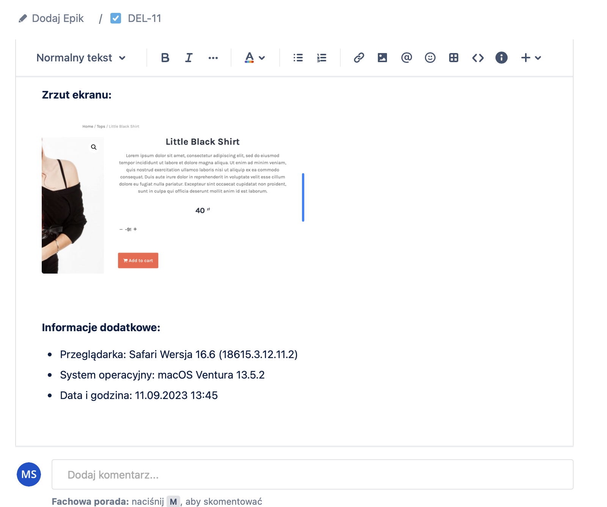

# portfolio

# header1
## header2
#### header4

## Moje kursy i szkolenia
  - Kurs 1
    - Certyfikat 1
    - Certyfikat 2
  - Kurs 2
1. jeden
2. dwa

zwykły tekst

[Przejdź do wikipedii...](https://www.wikipedia.org)

Znajomość języków programowania, aplikacji i technologii:
  - HTML & CSS
  - JavaScript
  - C#
  - SQL

  - Microsoft Azure
  - GitHub
  - Visual Studio
  - Xampp

Testowane aplikacje internetowe:
 - [SklepTest.pl](https://skleptest.pl)
 - [Delikont.pl](https://delikont.pl)

Zgłoszone błędy:
  - Skleptest.pl :
    - 
    - 
  - Delikont.pl :
    - 
    - 
    - 
    - 

